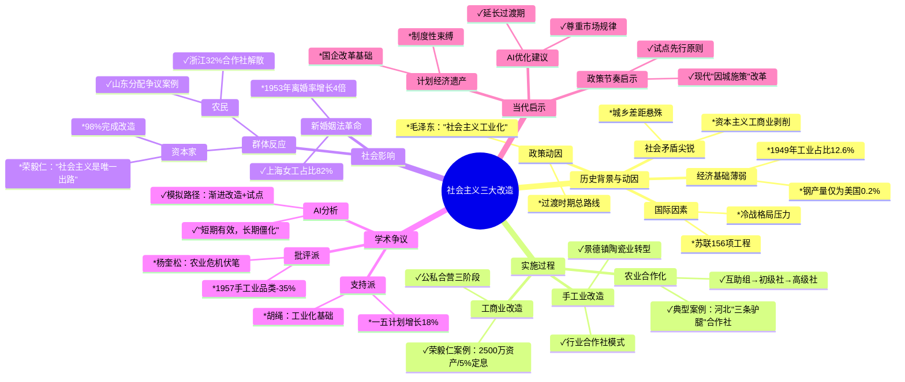
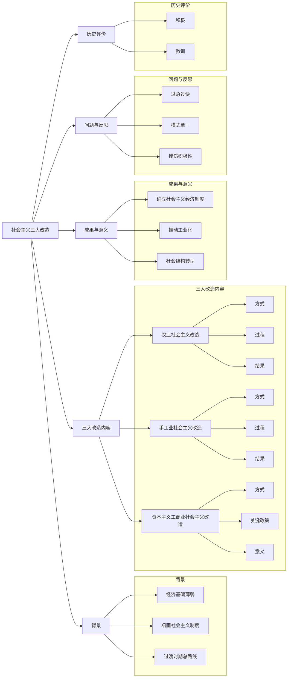

```mermaid
mindmap
  root((社会主义三大改造))
    历史背景与动因
      经济基础薄弱
        *1949年工业占比12.6%
        *钢产量仅为美国0.2%
      社会矛盾尖锐
        *城乡差距悬殊
        *资本主义工商业剥削
      政策动因
        *毛泽东："社会主义工业化"
        *过渡时期总路线
      国际因素
        *苏联156项工程
        *冷战格局压力
    
    实施过程
      农业合作化
        ✓互助组→初级社→高级社
        ✓典型案例：河北"三条驴腿"合作社
      手工业改造
        ✓行业合作社模式
        ✓景德镇陶瓷业转型
      工商业改造
        ✓公私合营三阶段
        ✓荣毅仁案例：2500万资产/5%定息
    
    社会影响
      新婚姻法革命
        *1953年离婚率增长4倍
        ✓上海女工占比82%
      群体反应
        资本家
          *98%完成改造
          *荣毅仁："社会主义是唯一出路"
        农民
          ✓浙江32%合作社解散
          ✓山东分配争议案例
    
    学术争议
      支持派
        *胡绳：工业化基础
        *一五计划增长18%
      批评派
        *杨奎松：农业危机伏笔
        *1957手工业品类-35%
      AI分析
        ✓"短期有效，长期僵化"
        ✓模拟路径：渐进改造+试点
    
    当代启示
      计划经济遗产
        *国企改革基础
        *制度性束缚
      政策节奏启示
        ✓现代"因城施策"改革
        ✓试点先行原则
      AI优化建议
        ✓延长过渡期
        ✓尊重市场规律
```

```mermaid
graph LR
  M[社会主义三大改造]
  M --> A[背景]
  A --> A1
  A --> A2
  A --> A3
  M --> B[三大改造内容]
  B --> B1
  B --> B2
  B --> B3
  M --> C[成果与意义]
  C --> C1
  C --> C2
  C --> C3
  M --> D[问题与反思]
  D --> D1
  D --> D2
  D --> D3
  M --> E[历史评价]
  E --> E1
  E --> E2
  subgraph 背景
    A1[经济基础薄弱]
    A2[巩固社会主义制度]
    A3[过渡时期总路线]
  end
  subgraph 三大改造内容
    B1[农业社会主义改造] --> B1a[方式]
    B1 --> B1b[过程]
    B1 --> B1c[结果]
    B2[ 手工业社会主义改造] --> B2a[方式]
    B2 --> B2b[过程]
    B2 --> B2c[结果]
    B3[ 资本主义工商业社会主义改造] --> B3a[方式]
    B3 --> B3b[关键政策]
    B3 --> B3c[意义]
  end
  subgraph 成果与意义
    C1[确立社会主义经济制度]
    C2[推动工业化]
    C3[社会结构转型]
  end
  subgraph 问题与反思
    D1[过急过快]
    D2[模式单一]
    D3[挫伤积极性]
  end
  subgraph 历史评价
    E1[积极]
    E2[教训]
  end
```
