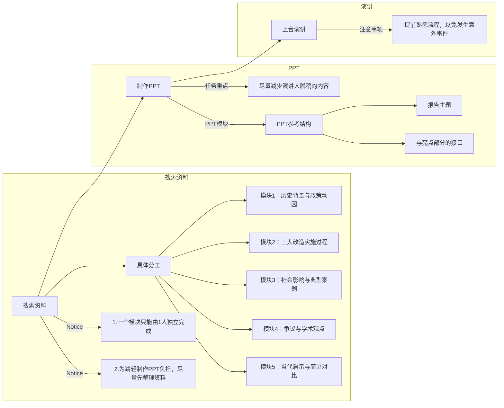

```mermaid
graph LR
  perA[搜索资料] --> perB[制作PPT]
  perB --> perC[上台演讲]
  subgraph 搜索资料
    perA --> A[具体分工]
    A --> Pa1[模块1：历史背景与政策动因]
    A --> Pa2[模块2：三大改造实施过程]
    A --> Pa3[模块3：社会影响与典型案例]
    A --> Pa4[模块4：争议与学术观点]
    A --> Pa5[模块5：当代启示与简单对比]
    perA -->|Notice| A1[1.一个模块只能由1人独立完成]
    perA -->|Notice| A2[2.为减轻制作PPT负担，尽量先整理资料]
  end
  subgraph PPT
    perB -->|任务重点| B1[尽量减少演讲人脱稿的内容]
    perB -->|PPT模块| B2[PPT参考结构]
    B2 --> TB1[报告主题]
    B2 --> TB2[与亮点部分的接口]
  end
  subgraph 演讲
    perC -->|注意事项| C[提前熟悉流程，以免发生意外事件]
  end
```

# 分工
|任务|完成人员|
|----|--------|
|搜索资料|其他成员(9.29.39.59)|
|PPT|49 吕俊豪|
|演讲|19 张柯|
