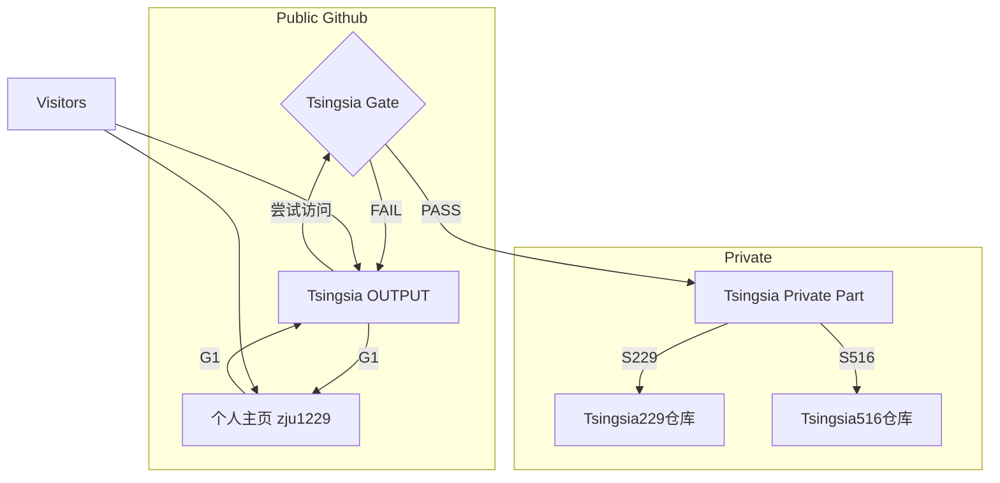
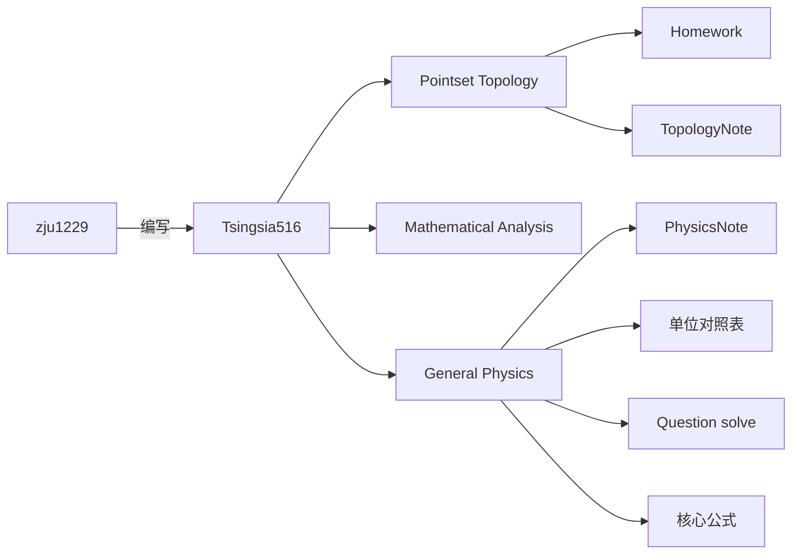
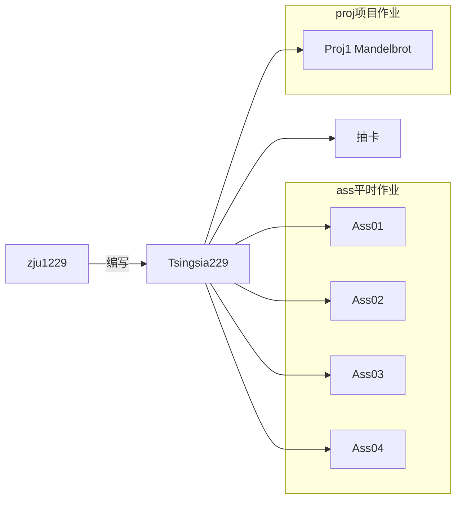

# $`\textcolor{#a8cf36}{\text{TsingsiaOUTPUT}}`$
## $`\textcolor{#58cc84}{\text{———————————}}`$$`\textcolor{#40dda0}{\text{简介}}`$$`\textcolor{#58cc84}{\text{—————————}}`$
- 我的门户仓库  
## 仓库拓扑图

---

## ——————————————————GATE————————————————
### ———————Part B 境内———————
- [S229](https://github.com/zju1229/Tsingsia229/tree/main)    ->229仓库(CS)
- [S516](https://github.com/zju1229/Tsingsia516/tree/main) 
->516仓库(MATH)

---

### ———————Part C 出境——————— 
- [G1](https://github.com/zju1229)  ->首页
- [G11](https://github.com/BukSeong/58Glory) ->共享区
